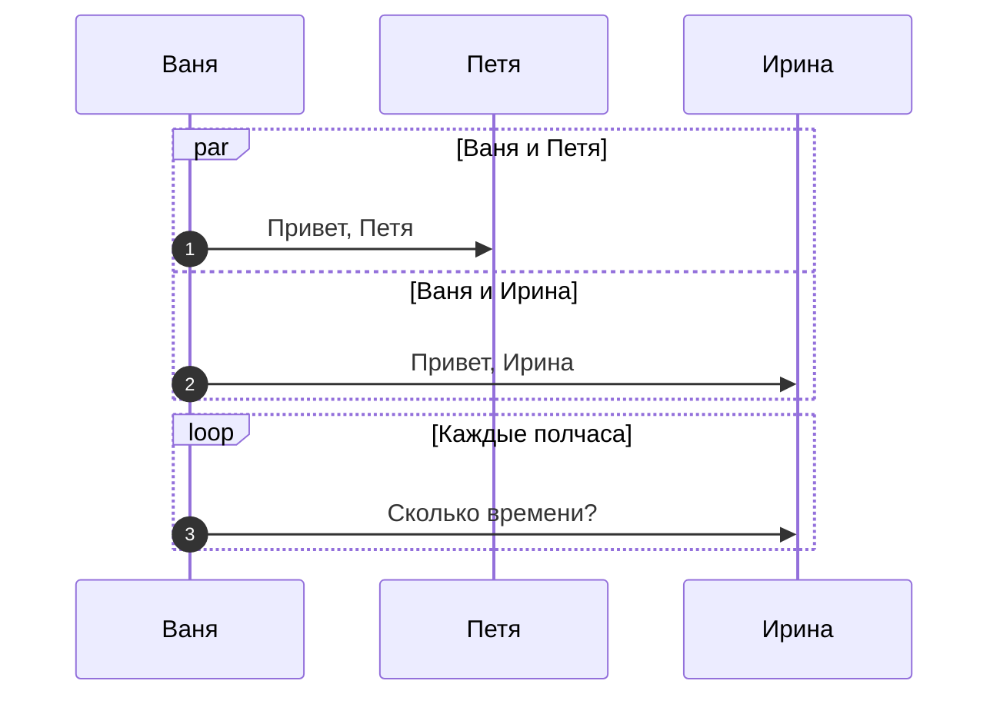

# telegram-ToDo
блог по работе над проектом лежит по адресу <a href="https://github.com/KizurovAS/telegram-ToDo/blob/master/about.txt">/about.txt</a>

техническое задание лежит по адресу <a href="https://github.com/KizurovAS/telegram-ToDo/blob/master/technical_task.docx">/technical_task.docx</a>

возможности версии лежат по адресу <a href="https://github.com/KizurovAS/telegram-ToDo/blob/master/versions.txt">/versions.txt</a>

