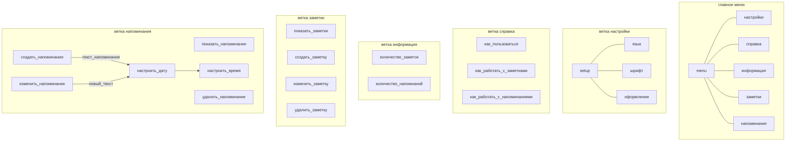

<h1>Техническое задание на создание чат-бота telegram-ToDo</h1>

<b>Цель:</b> список задач с возможностью напоминаний

<b>Задачи:</b> 

1. Определить целевую аудиторию  
2. Определить функциональность  
3. Сформулировать логику чат-бота  
4. Спрогнозировать реплики  
5. Визуальзировать флоу диалога  
6. Разработать тестирование  
7. Выполнить публикацию чат-бота 

<a><h2>1 Целевая аудитория.</h2> 

 Пользователь телефона и/или компьютера, имеющий необходимость делать заметки по разным категориям в мессенджере.  
Возраст: не ограничен  
Пол: не ограничен  
Язык: русский  
Канал взамодействия: Telegram 
</a>

  <a><h2>2 Функциональность.</h2> 
  

Отображение справки.  
Создание текста заметки.  
Отображение заметок.  
Редактирование заметки.  
Удаление заметок.  
<s>//Изменение атрибутов заметок.  
//Создание категорий.  
//Отображение категорий.  
//Редактирование категорий.  
  //Удаление категорий. </s> 
Отображение меню.  
Настройка времени напоминания заметки. 
</a>

  <h2>3 Логика чат-бота. </h2>

 3.1 В начале диалога отображается кнопочное меню.  
Кнопочное меню включает: настройки; справка; информация; заметки; напоминания.  
При отправке сообщения в меню бот автоматически переходит в ветку создания. 

3.2 Меню настройки позволяет изменить язык интерфейса, шрифты и оформление (текст, иконки / иконки). 

3.3 Ветка справка выводит текстовое сообщение с основными функциями и инструкцией по использованию чат-бота в рамках данного контекста с представлением ссылки на видеоинструкцию.  
Кнопочное меню не изменяется.  
При отправке сообщения в справке бот автоматически переходит в ветку создания. 

3.4 Ветка информация выводит список, содержащий количество заметок, напоминаний.  
Отображается кнопочное меню: справка; домой; заметки; напоминания.  
При отправке сообщения в информации бот автоматически переходит в ветку создания. 

3.5 Ветка заметки выводит индексированный список заметок и кнопочное меню: справка, домой, напоминания, создать.  
При отправке индекса заметки осуществляется переход в ветку редактирования заметки, при отправке иного сообщения бот автоматически переходит в ветку создания. 

3.6 Ветка напоминания выводит индексированный список напоминаний с датами и временами и кнопочное меню: справка, домой, заметки, создать.  
При отправке индекса напоминания осуществляется переход в ветку редактирования напоминания, при отправке иного сообщения бот автоматически переходит в ветку создания. 

3.7 Ветка создать в ответ на сообщение просит выбрать тип создаваемого объекта: заметка или напоминание,  
также кнопочное меню: справка; домой; заметки; напоминания.  
При сохранении напоминания необходимо ввести дату и время напоминания (по дефолту через 10 минут). 

3.8 Ветка редактирования заметки отображает текст заметки и кнопочное меню: справка; домой; редактировать; удалить.  
При редактировании просит подтвердить сохранить предлагаемые изменения.  
При удалении просит подтвердить удаление заметки. 

3.9 Ветка редактировать напоминание выводит дату и время напоминания и его текст и кнопочное меню: справка; домой; редактировать; удалить.  
При редактировании спрашивает что редактировать, текст или дату.  
При редактировании текста просит подтвердить сохранить предлагаемые изменения.  
При редактировании времени напоминания просит подтвердить сохранить предлагаемые изменения.  
При удалении просит подтвердить удаление напоминания. 

3.10 При напоминаниии бот отправляет push-уведомление с тексток напоминания и кнопочным меню: редактировать; отложить; удалить. При отсутствии реакции через 10 минут повторяется уведомление.  
При удалении просит подтвердить удаление напоминания.  
При отложении выводит кнопочное меню: 10 минут; 30 минут; 1 час без подтверждения сохранения изменений. 

  
<b> Иконки </b>

    <a>
  - домой  
     - справка  
     - информация  
     - заметки  
     - напоминания  
     - настройки  
     - добавить  
     - редактировать  
     - удалить  
     - да  
     - нет 
</a>
    
  

<h2>4 Реплики</h2>

    
В процессе работы бота подразумевается с клавиатуры вводить только текст заметок/напоминаний и дату/время напоминания. Все остальные действия происходят по нажатию кнопок. Вместе с тем, пользователь может попытаться ввести некоторые фразы по работе с ботом.

    
<b>Например:</b>

    <i>
    добавить/добавь заметку/напоминание 
    добавить/добавь заметку/напоминание "текст заметки" 
    покажи/показать/выведи заметки/напоминания 
    удалить/удали заметку/напоминание 
    удалить/удали заметки/напоминания 
    удалить/удали все заметки/напоминания 
    заметки/заметка/напоминание/напоминания 
    настройка/настроки 
    меню 
    назад 
    справка 
    покажи справку 
    инфо/информация 
    покажи информацию 
    как пользоваться/работает 
    что делать 
    напомни "текст напоминания" 
    напомни "время" "текст напоминания" 
    "время" "текст напоминания" 
    </i>
    

    

<h2>5 Флоу диалога</h2>

<h2>6 Автотестирование</h2>

    
Составлено два файла автотестирования:  
    -тестирование меню;  
    -тестирование работы заметок. 
    Автотестирование меню осуществляет следующие проверки:  
    -Начальное приветствие; 
    -Переход в настройки и возврат домой; 
    -Просмотр справки; 
    -Просмотр информации; 
    -Переход в заметки и домой. 
    Автотестирование работы заметок осуществляет следующие проверки: 
    -Удаление всех заметок; 
    -Добавление 4х заметок; 
    -Изменение одной заметки; 
    -Удаление одной заметки.
    

